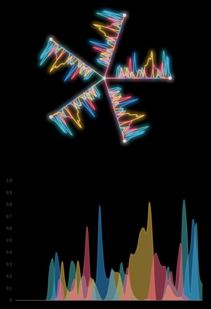

# Hivemind

Hivemind consumes signals between entities at various resolutions and displays them in real-time through a unique time series visualization.



## Setting Up

### Prerequisites

- Docker
- Node.js and npm

### Run TimescaleDB

Start TimescaleDB with the following command:

```bash
docker run -d --name timescaledb -p 5432:5432 -e POSTGRES_PASSWORD=password timescale/timescaledb-ha:pg14-latest
```

## Database Setup
Once TimescaleDB is running, set up your database using `server/db.sql`.
This will create the necessary tables, hypertables, materialized views, and functions.

## Run the Server
Navigate to the server directory, install dependencies, and start the server:

```bash
cd server
npm install
npm run dev
```

## Run the Client
Set up and start the client in a similar manner:

```bash
cd client
npm install
npm run dev
```

## User Interaction
In this demo, users can generate incoming signals corresponding to various emotions or actions by pressing designated keys:

<kbd>J</kbd> - Joy

<kbd>S</kbd> - Sadness

<kbd>L</kbd> - Love

<kbd>T</kbd> - General Thought

While signals in the demo are generated via key inputs, the future plan is to connect this to a more meaningful source, such as user sentiment signals or even a brain-computer interface 🤯.

## Demo

This demo features 5 users, demonstrating duplicated signals for a more comprehensive visualization. The client connects to the server via a basic WebSocket stream, allowing for real-time interaction and signal processing.
